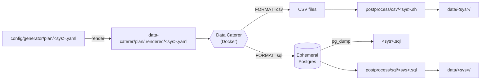

# seed-data-gen

Relationally-intact sample datasets, generated with [Data Caterer
0.19.1](https://data.catering/0.19.1/) and driven entirely by Docker.
Zero host dependencies beyond Docker itself, so it drops cleanly into
other repos as a git submodule.

Every foreign-key-shaped value resolves to a real parent row — verified
against the real Data Caterer image, not assumed from its docs. See each
plan file's header comment for details.

## Prerequisites

- Docker, with Compose v2 (`docker compose`, not the standalone
  `docker-compose` binary)

## Systems

A "system" is one dataset: a plan file under `config/generator/plan/`,
plus an optional post-processing script.

| System    | Tables                                                                             | `FORMAT=sql` |
|-----------|-------------------------------------------------------------------------------------|:------------:|
| `banking` | party, party_address, party_contact, party_profile, accounts, account_contracts, transactions | ✅ |
| `retail`  | customer, supplier, product, employee, shift_roster, order, order_item, invoice     | ✅ |

## Usage

```sh
make seed SYS=banking
make seed SYS=retail
```

Output lands in `data/<sys>/` (gitignored): one clean CSV per table,
header row included, no leftover Spark part-files.

Data Caterer's log output is quiet by default. For full detail, set
`LOG_LEVEL=info` on the `data-caterer` service in the relevant
`config/docker/docker-compose.*.yaml`, or pass `-e LOG_LEVEL=info` when
calling `docker compose` directly.

## How it works



Each plan is rendered once per run, then handed to a one-shot Data
Caterer container. Optional post-processing fixes up anything the plan
itself can't express (see `config/generator/plan/banking.yaml`'s header
comment for the confirmed list of Data Caterer 0.19.1 quirks this works
around).

## Postgres dump

```sh
make seed SYS=banking FORMAT=sql
make seed SYS=retail FORMAT=sql
```

`FORMAT` defaults to `csv`. `FORMAT=sql` starts an ephemeral Postgres
container, generates the same dataset directly into it, applies a SQL
fixup if the system needs one, and runs `pg_dump` into
`data/<sys>/<sys>.sql` (`CREATE DATABASE`/`CREATE TABLE` plus an `INSERT`
per row). The container is never reachable outside Docker and never
persists past one run.

Both systems support it. `FORMAT=sql` on a system with no dual-format
plan fails immediately with a clear error, before touching Docker
(`make validate-plan` also catches this statically — see "Adding a
system" below).

To add Postgres support for another system, follow `banking.yaml`: one
`dataSources` entry serves both formats, selected at render time by
`data-caterer/script/seed.sh`. See that plan's header comment for the
full mechanism, and `retail.yaml`'s header comment for a real Spark/JDBC
gotcha found migrating it (a table can't be named `order` — it's a
reserved SQL keyword Spark doesn't quote).

## Adding a system

Drop in `config/generator/plan/<sys>.yaml` — `make seed SYS=<sys>` picks
it up immediately, no other changes needed. Output paths in the plan
must write under `/opt/app/data/<sys>/` to match the volume mount in
`config/docker/docker-compose.seed.yaml`, and every step must declare
`options` for every format listed in
`config/generator/common/datasources.yaml` (currently `csv` and `sql`)
— see that file and CONTRIBUTING.md's "Writing a plan file". Adding
support for a new output format entirely (not just a new system) means
adding it to `datasources.yaml`, which then becomes required on every
existing plan too.

See `banking.yaml`'s and `retail.yaml`'s header comments for the plan
format and every Data Caterer gotcha found building them. Verify
anything new directly against the real image — row counts, FK
resolution — rather than trusting Data Caterer's documentation. See
`CONTRIBUTING.md`.

If a plan needs fix-up Data Caterer can't express in-plan, add an
executable `data-caterer/postprocess/csv/<sys>.sh` (and, for `FORMAT=sql`
support, `data-caterer/postprocess/sql/<sys>.sql`). `make seed` runs it
automatically after generation, passing the output directory as `$1`. A
system with nothing to fix up simply has no such script.

### Validating a plan

```sh
make validate-plan SYS=banking   # or omit SYS to check every plan
make install-hooks               # once per clone: enforce it on commit
```

`make validate-plan` lints a plan file against the Data Caterer 0.19.1
bugs and conventions catalogued in `CONTRIBUTING.md`'s "Writing a plan
file" checklist — a fast, offline check, not a substitute for `make
seed`. `make install-hooks` wires the same check into a pre-commit hook
that runs automatically on any staged plan file.

## As a submodule

```sh
git submodule add https://github.com/avikbesu/seed-data-gen.git seed-data-gen
```

Pin the checkout path in one Makefile variable instead of hardcoding it
inline:

```makefile
SEED_MODULE := seed-data-gen
FORMAT ?= csv

seed: ## Populate seed data for a system, e.g. `make seed SYS=banking` (or FORMAT=sql, for systems that support it)
	@test -n "$(SYS)" || { echo "usage: make seed SYS=<system> [FORMAT=csv|sql]" >&2; exit 1; }
	git submodule update --init $(SEED_MODULE)
	@test -f $(SEED_MODULE)/config/generator/plan/$(SYS).yaml || { echo "seed: no plan for SYS=$(SYS)" >&2; exit 1; }
	$(MAKE) -C $(SEED_MODULE) seed SYS=$(SYS) FORMAT=$(FORMAT)
	mkdir -p data
	cp -r $(SEED_MODULE)/data/$(SYS) data/$(SYS)
```

This works unmodified for every system the module provides, present or
future; `FORMAT` passes straight through. `$(SEED_MODULE)` must match
wherever `git submodule add` checked it out. The final `cp` is optional —
skip it and point consumers at `$(SEED_MODULE)/data/$(SYS)/` directly if
a stable `data/<sys>` path decoupled from the submodule's location isn't
needed.

> **Breaking path change**: plan files moved from `data-caterer/plan/` to
> `config/generator/plan/`. If you vendored this repo before that move,
> update the `test -f` line above (and anything else referencing
> `data-caterer/plan/`) to the new path.

## Layout

| Path | Purpose |
|------|---------|
| `config/generator/plan/<sys>.yaml` | Schema, fields, and relationships for one system, as a single `dataSources` entry. Rendered into `data-caterer/plan/.rendered/<sys>.yaml` (gitignored) before every run. |
| `config/generator/common/datasources.yaml` | Registry of output formats this repo supports and each one's required `options` keys — every plan step must declare all of them. |
| `config/docker/docker-compose.seed.yaml` | One-shot service for `FORMAT=csv`. |
| `config/docker/docker-compose.postgres.yaml` | Ephemeral Postgres + Data Caterer services for `FORMAT=sql`, torn down every run. |
| `data-caterer/script/seed.sh` | The `make seed` implementation. |
| `data-caterer/script/hoist.awk` | Resolves each step's format-specific `options` down to the shape Data Caterer expects. |
| `data-caterer/script/validate-plan.sh` | The `make validate-plan` implementation — runs `validate_plan.py` in a one-off `python:3.12-slim` container. |
| `data-caterer/script/plan-rules.yaml` / `validate_plan.py` / `plan_yaml.py` | The rule-based plan lint: declarative rules (YAML), a small stdlib-only YAML-subset loader, and the engine that applies them. |
| `.githooks/pre-commit` | Runs the same lint against staged plan files. Enabled by `make install-hooks`. |
| `data-caterer/application.conf.template` | Spark runtime defaults, rendered into `application.conf` (gitignored) each run. |
| `data-caterer/application-jdbc.conf.template` | Postgres connection details, appended only for `FORMAT=sql`. |
| `data-caterer/postprocess/csv/<sys>.sh` | Optional `FORMAT=csv` fix-up. |
| `data-caterer/postprocess/sql/<sys>.sql` | Optional `FORMAT=sql` fix-up, run via `psql`. |
| `data-caterer/README.md` | Schema notes and every Data Caterer 0.19.1 issue worked around in the `banking` plan. |

## Known limitations

- No fast syntax-check loop for editing a plan — every change currently
  requires a full `make seed` run (Data Caterer's JVM/Spark startup is a
  ~20s floor). Tracked in
  [#1](https://github.com/avikbesu/seed-data-gen/issues/1).

## Contributing

See [`CONTRIBUTING.md`](CONTRIBUTING.md) before making changes.
